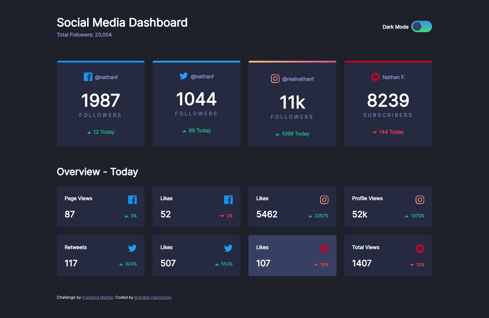

# Frontend Mentor - Social media dashboard with theme switcher solution

This is a solution to the [Social media dashboard with theme switcher challenge on Frontend Mentor](https://www.frontendmentor.io/challenges/social-media-dashboard-with-theme-switcher-6oY8ozp_H). Frontend Mentor challenges help you improve your coding skills by building realistic projects.

## Table of contents

- [Overview](#overview)
  - [The challenge](#the-challenge)
  - [Screenshot](#screenshot)
  - [Links](#links)
- [My process](#my-process)
  - [Built with](#built-with)
  - [What I learned](#what-i-learned)
  - [Continued development](#continued-development)
- [Author](#author)

## Overview

### The challenge

Users should be able to:

- View the optimal layout for the site depending on their device's screen size
- See hover states for all interactive elements on the page
- Toggle color theme to their preference

### Screenshot



### Links

- Solution URL: [https://github.com/brandonmharrington/social-media-dashboard](https://github.com/brandonmharrington/social-media-dashboard)
- Live Site URL: [https://brandonmharrington.github.io/social-media-dashboard](https://brandonmharrington.github.io/social-media-dashboard)

## My process

### Built with

- Semantic HTML5 markup
- CSS custom properties
- Flexbox
- CSS Grid
- Mobile-first workflow
- JavaScript event handler

### What I learned

I learned more about working with mobile-first workflow. Creating a mobile-friendly, responsive site makes it very easy to add some styling for large screens later. I also learned how to make a theme switcher. I created CSS color variables for light and dark themes and used a simple JS event handler to change the class of the HTML body from 'dark' to 'light'. I got practice using CSS grid, which made the design of the cards incredibly simple.

Finally, I got some practice turning a checkbox into a sleek-looking slider similar to what you would find on iOS devices.

```js
const toggle = document.querySelector('.toggle input');
const body = document.body;

toggle.addEventListener('click', e => {
  if (e.target.checked) {
    body.classList.remove('dark');
    body.classList.add('light');
  } else {
    body.classList.remove('light');
    body.classList.add('dark');
  }
});
```

### Continued development

I want to continue practicing CSS grid as I am much more familiar with flexbox and this project opened my eyes to how powerful grids can be and extremely easy to implement. In addition, I want to practice using :before and :after attributes in CSS as they still cause me some confusion at times.

## Author

- Website - [Brandon Harrington](https://brandon-harrington.netlify.app)
- Frontend Mentor - [@brandonmharrington](https://www.frontendmentor.io/profile/brandonmharrington)
- Github - [@brandonmharrington](https://github.com/brandonmharrington)
